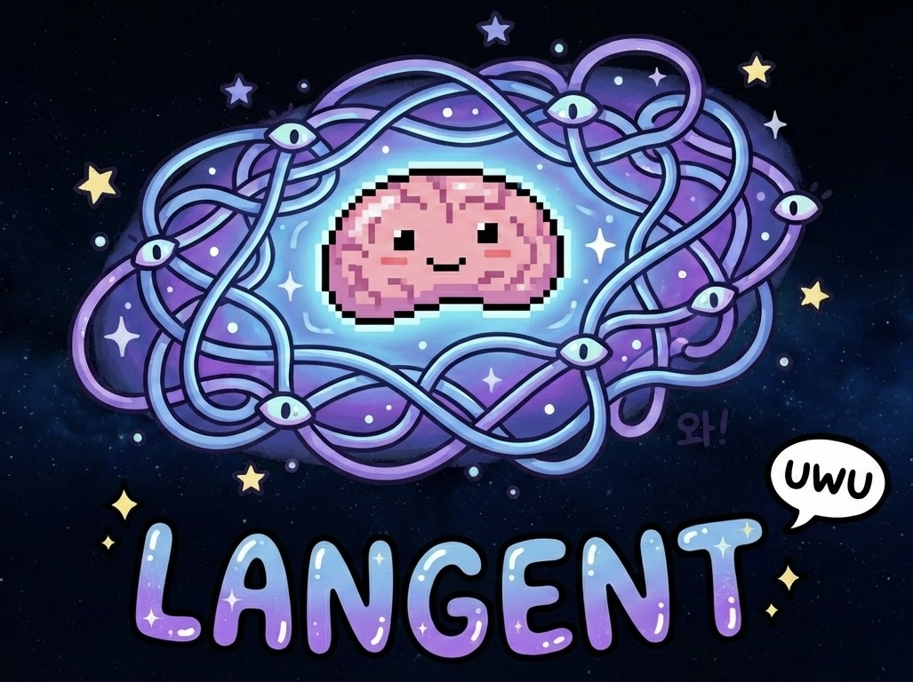

# 🌌 Langent — Personal Ontology & 3D Knowledge Nebula

[](https://opensource.org/licenses/Apache-2.0)
[](https://www.python.org/downloads/)

**Langent** is a RAG (Retrieval-Augmented Generation) framework that transforms your local workspace into a 3D cosmic nebula of knowledge. It combines vector embeddings (ChromaDB) with knowledge graphs (Neo4j) to provide a deeply connected AI experience.

(docs/nebula_full.png)

### 📺 Watch the Demo
[](https://youtu.be/8HLQO52VO5g)

---

## ✨ Key Features

- **📂 Auto-Ingestion**: Automatically scans and indexes MD, PDF, TXT, CSV, JSON, and YAML files.
- **🧠 Hybrid RAG**: Merges semantic vector search with graph-based relationship traversal for superior context.
- **🌌 3D Nebula Visualizer**: Explore your knowledge base in an interactive Three.js 3D environment.
- **🔗 Knowledge Linking**: Automatically discovers and creates relationships between your documents and entities.
- **🤖 MCP Integration**: Built-in support for Model Context Protocol (MCP) to plug into Claude Desktop, Antigravity, and more.

---

## 🚀 Installation & Quick Start

### 1. Install via Pip

```bash
git clone https://github.com/yourusername/langent.git
cd langent
pip install -e .
```

### 2. Configure Environment

```bash
cp .env.example .env
```
Edit `.env` to set your `LANGENT_WORKSPACE` (the folder containing your documents).

### 3. Ingest & Serve

```bash
langent ingest --path ./samples  # Start with our sample data!
langent serve                    # Open http://localhost:8000
```

---

## � Data Workflow: From Workspace to 3D Nebula

Langent automates the complex journey from raw raw files to an interactive 3D knowledge universe.

1.  **Gather Data (Workspace)**: Drop your "data lumps" (PDFs, Markdown notes, CSV spreadsheets, Research papers) into your connected `LANGENT_WORKSPACE` folder.
2.  **Chunking**: Langent automatically breaks these large files into smaller, semantically meaningful chunks (300-500 tokens).
3.  **Vectorization (ChromaDB)**: 
    - Using local embedding models (e.g., `all-MiniLM-L6-v2`), each chunk is transformed into a high-dimensional vector.
    - These vectors are stored in **ChromaDB** for lightning-fast semantic retrieval.
4.  **3D Projection**: 
    - Langent uses advanced dimensionality reduction (UMAP) to project these high-dimensional vectors into a **3D Point Cloud**.
    - Points that are semantically similar "cluster" together in space, forming the constellations of your knowledge base.

> **Result**: Your messy folder becomes a beautiful, searchable, and navigable 3D cosmic map.

---

## �🛠️ Advanced Setup

### 1. Connecting to Neo4j (Graph Store)
To enable the **Knowledge Graph** features (searching relationships, linking entities), you need a Neo4j instance.

- **Option A: Docker (Recommended)**
  ```bash
  docker run \
      --name langent-neo4j \
      -p 7474:7474 -p 7687:7687 \
      -e NEO4J_AUTH=neo4j/your_password \
      neo4j:latest
  ```
- **Option B: Neo4j Desktop**
  Install [Neo4j Desktop](https://neo4j.com/download/), create a local project, and update your `.env`:
  ```env
  NEO4J_URI="bolt://localhost:7687"
  NEO4J_USER="neo4j"
  NEO4J_PASSWORD="your_password"
  ```

### 2. MCP Integration (Claude & Antigravity)
Langent acts as an **MCP (Model Context Protocol)** server, allowing AI agents like Claude or Antigravity to use your workspace as their long-term memory.

- **For Antigravity / Claude Desktop**:
  Add the following to your `mcp_config.json`:
  ```json
  "langent": {
    "command": "python",
    "args": ["-m", "langent.server.mcp_server"],
    "env": {
      "LANGENT_WORKSPACE": "/path/to/your/workspace"
    }
  }
  ```

### 🤖 Using Langent with AI Agents (Antigravity, Claude Code)
Once connected via MCP, you can talk to your workspace as if it's an intelligent entity.

- **Data Ingestion**: 
  > "Langent의 mcp 도구를 사용해서 내 워크스페이스에 있는 새로운 문서들을 인덱싱해줘."
- **Semantic Search**: 
  > "내 워크스페이스에서 'AI 미래 전략'과 관련된 내용을 네뷸라에서 검색해서 요약해줘."
- **Graph Insight**:
  > "내 연구 주제인 'AI 에이전트'와 가장 많이 연결된 핵심 키워드들을 그래프로 분석해서 보고서로 만들어줘."

Langent provides the AI with specific tools (`ingest_workspace`, `search_nebula`, `query_graph`) allowing it to act as a 3D Knowledge Librarian.

---

## 🌌 How to use Nebula 3D Visualizer

Once you run `langent serve`, navigate to `http://localhost:8000`.

- **Points (Star Dust)**: Each point represents a chunk of your documents. 
  - 🎨 **Lavender**: Regular markdown/text files.
  - 💖 **Hot Pink**: Important entities like "Alex AI" or yourself.
- **Nodes (Planets)**: These are entities extracted into the Neo4j Graph.
- **Lines (Cosmic Strings)**:
  - **Weak Lines**: Relationships between graph entities.
  - **Dashed Lines**: Semantic links between vector points and graph nodes.
- **Controls**:
  - **Left Click**: Select a point to see its original content.
  - **Right Click / Drag**: Rotate the universe.
  - **Scroll**: Zoom in/out of the knowledge cluster.
  - **Search Bar**: Type a keyword (e.g., "Suseo") to highlight matching stars in white.

---

## 📄 License

This project is licensed under the Apache License 2.0.

---
*Created with ❤️ by Alex AI*


